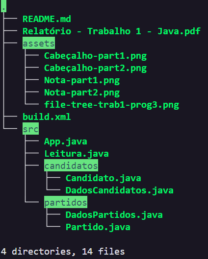
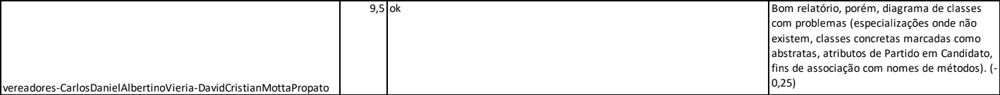
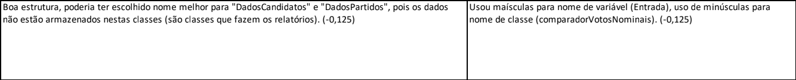

# Analise eleitoral

Trabalho desenvolvido por Carlos Daniel Albertino Vieria (@paisdegales) e David Cristian Motta Propato (@Propato) da matéria Programação Orientada a Objetos (Programação 3) na UFES sobre orientação do professor João Paulo Andrade Almeida. 

Este é o primeira trabalho da matéria e consiste em implementar um sistema em Java capaz de processar dados obtidos da Justiça Eleitoral referentes à votação de vereadores de forma a levantar informações e gerar relatórios sobre as eleições de 2020 em um município, a fim de aplicar e desenvolver os conhecimentos adquiridos em aula. 

Através da linha de comando, quando se executo o programa são passados os endereços de arquivos de entrada que contém as informações dos candidatos e partidos de onde se extrairá e processará os dados, bem como a data da eleição.

# Conteúdo

    Os arquivos .java de todas as classes.
    Uma pasta com testes disponibilizados pelo professor que contém um script que executa os códigos e compara com as saídas geradas com as saídas esperadas automaticamente, indicando caso haja diferenças.
    E uma arquivo build para compilar e executar os códigos. 

>Pasta script não está inclusa a fim de simplificação.

# Comandos do build:

    ant init
cria uma pasta bin para armazenar os arquivos .class gerados

    ant compile
gera os arquivos .class, armazenando-os na pasta bin.

    ant run
executa o código com os argumentos de entrada especificados no build.

    ant jar
gera o arquivo .jar do código.

    java -jar vereadores.jar <entrada_teste_candidato.csv> <entrada_teste_partido.csv> <data_eleição = dd/MM/yyyy>
Executar o arquivo .jar.

# Bugs conhecidos:

Apesar de lidar com as possiveis exceções encontradas, o código não para de ser executado caso alguma exceção seja capturada.

# Nota do Professor -> 9.5

