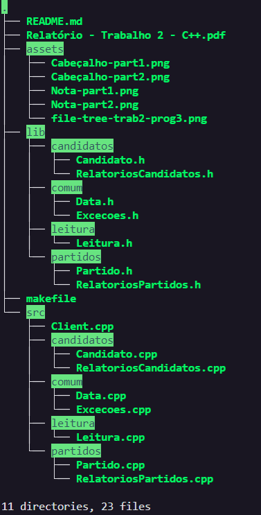
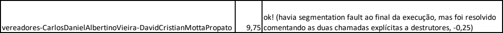
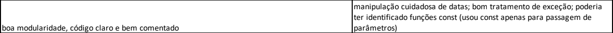

# Analise eleitoral

Trabalho desenvolvido por Carlos Daniel Albertino Vieria (@paisdegales) e David Cristian Motta Propato (@Propato) na matéria Programação Orientada a Objetos (Programação 3) na UFES sobre orientação do professor João Paulo Andrade Almeida. 

Este é o segundo trabalho da disciplina e consiste em implementar um sistema em C++ capaz de processar dados obtidos da Justiça Eleitoral referentes à votação de vereadores, de forma a levantar informações e gerar relatórios sobre as eleições de 2020 em um município, a fim de aplicar e desenvolver os conhecimentos adquiridos em aula. 

Através da linha de comando, quando se executo o programa são passados os endereços de arquivos de entrada que contém as informações dos candidatos e partidos de onde se extrairá e processará os dados, bem como a data da eleição.

# Conteúdo

    Os arquivos .cpp e .h de todas as classes e o Client.h.
    Uma pasta com testes disponibilizados pelo professor que contém um script que executa os códigos e compara com as saídas geradas com as saídas esperadas automaticamente, indicando caso haja diferenças.
    E uma arquivo Makefile para compilar e executar os códigos. 

>Pasta script não está inclusa a fim de simplificação.

# Comandos do build

    make all
Compilar
    
    make run
Rodar programa/build

    make clean
Deletar arquivos-objeto e executavel do diretorio

# Bugs conhecidos:
para as exceções de conversão de string para inteiro, a linguagem só reconhece erro na conversão quando as letras estão no inicio, ex:
>56hhg767, usando a função stoi() receberemos 56.

>er4556yt7, usando a mesma função, receberemos uma exceção.

# Nota do Professor -> 9.75

